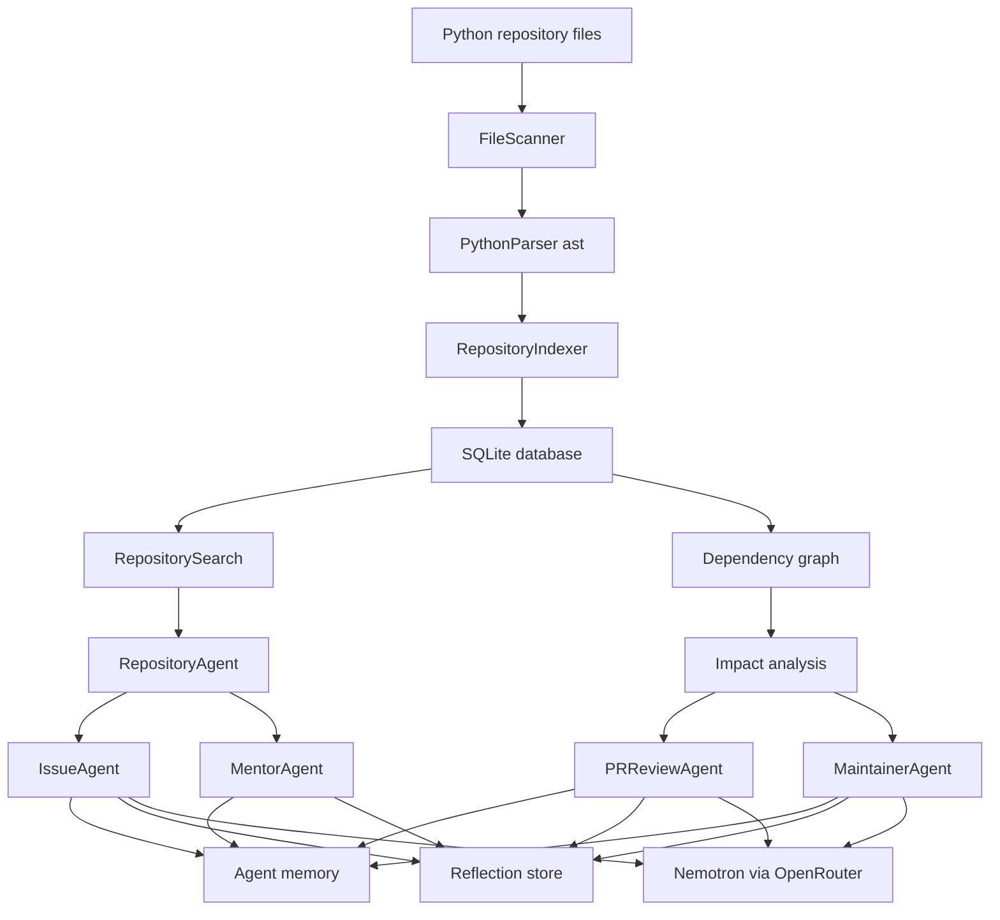

# ForgeMind

<div align="center">
  <h1 align="center">ForgeMind</h1>
  <p align="center">
    <strong>A Nemotron-powered maintainer copilot for repository intelligence, issue triage, review risk, and contributor onboarding</strong>
  </p>
  <p align="center">
    
    
    
    
    
  </p>
</div>

---

## Overview

**ForgeMind** is an early-stage open-source maintainer copilot that indexes Python repositories, extracts structural code intelligence, stores persistent agent memory, and uses NVIDIA Nemotron through OpenRouter for repository-aware engineering reports.

The project is organized around a local CLI and a set of focused agent workflows:

- repository indexing and symbol search
- dependency graph and impact analysis
- issue triage with related files, classes, severity, confidence, and reproduction steps
- PR review risk analysis for modified files
- maintainer health reports and hotspot detection
- contributor onboarding and learning-path generation
- shared memory and reflection storage across agent runs

At its current stage, ForgeMind should be understood as a **prototype maintainer intelligence system**, not a fully hardened production bot.

## Project Objective

ForgeMind is built around one central question:

> Can a local repository index, lightweight static analysis, persistent memory, and LLM reasoning reduce the cognitive load of maintaining an open-source project?

To explore that question, ForgeMind:

- scans Python source files using the standard `ast` module
- stores parsed imports, classes, and functions in SQLite
- builds repository search and dependency context from the local index
- routes specialized workflows through issue, PR review, mentor, and maintainer agents
- uses Nemotron reasoning to produce higher-level engineering summaries
- records memory and reflections so agent runs can accumulate context

## Current Project Status

ForgeMind has a working local CLI foundation, but some areas are still formative.

- Repository indexing for Python files is implemented.
- SQLite persistence exists for indexed files, memory records, and reflections.
- Search, graph, explanation, issue triage, PR review, maintainer, memory, reflection, and diagnostic commands are wired into the CLI.
- GitHub integration helpers exist for repositories, issues, and pull requests, but the `sync` command is not currently registered in `main.py`.
- The JavaScript parser module exists but is currently empty.
- The contributor mentor command is registered, but the current `MentorAgent.explain_contribution_path` implementation appears to be defined outside the class, so that workflow likely needs a small code fix before use.
- Runtime imports include packages that are not listed in `pyproject.toml`, including `openai`, `python-dotenv`, `requests`, and `nltk`.

That means this README documents the repository **as it exists now**, while calling out the gaps that should be resolved before packaging or public release.

## Architecture

ForgeMind is a CLI-first system layered over local indexing, SQLite storage, and agent workflows.



## System Design

ForgeMind has five main layers.

1. **CLI layer**: `main.py` registers Typer commands and shows the dashboard when no command is provided.
2. **Command layer**: `commands/` contains user-facing command handlers.
3. **Core intelligence layer**: `core/` contains parsing, indexing, search, graph, issue analysis, mentor logic, repository impact logic, reporting, and LLM orchestration.
4. **Agent layer**: `agents/` coordinates multi-step workflows for repository understanding, issue analysis, PR review, maintainer reports, and contributor mentorship.
5. **Storage and integration layer**: `storage/` and `integrations/` provide SQLite persistence, memory, reflection storage, and GitHub API helpers.

The current indexing flow is:

```text
Python source files
  -> FileScanner.scan_python_files()
  -> PythonParser.parse()
  -> RepositoryIndexer.index()
  -> SQLite files table
  -> RepositoryService / RepositorySearch / GraphBuilder
  -> CLI workflows and agent context
```

## Core Capabilities

### Repository Intelligence

ForgeMind can build a local code index from Python files and use it for:

- file-level repository summaries
- symbol and path search
- dependency graph generation from local imports
- file importance and impact scoring
- component explanations grounded in indexed files, classes, functions, and imports

Implemented primarily in:

- `core/indexer.py`
- `core/parser/python_parser.py`
- `core/search/repository_search.py`
- `core/graph/graph_builder.py`
- `agents/repository_agent/repository_agent.py`

### Issue Intelligence

The issue workflow classifies and analyzes issue text, then combines repository context with heuristics and LLM-backed recommendations.

It currently produces:

- issue type
- severity
- verification status
- confidence
- related files
- related classes
- reproduction steps
- recommended fix guidance

Implemented primarily in:

- `commands/triage.py`
- `agents/issue_agent/issue_agent.py`
- `core/issue/`
- `core/services/triage_service.py`

### Pull Request Review

ForgeMind includes a PR review agent that accepts a list of changed files, looks up impact data, and asks Nemotron for a structured review report.

It focuses on:

- risk level
- affected modules
- architectural impact
- review comments
- testing recommendations
- final recommendation

Implemented primarily in:

- `commands/review.py`
- `agents/pr_review_agent/pr_review_agent.py`
- `core/services/pr_review_service.py`

### Maintainer Advisor

The maintainer workflow combines repository health checks, hotspot analysis, and Nemotron-generated reporting.

It provides:

- repository health signals
- architectural hotspot ranking
- maintenance recommendations
- formatted maintainer reports
- memory and reflection records for the analysis

Implemented primarily in:

- `commands/maintain.py`
- `agents/maintainer_agent/maintainer_agent.py`
- `agents/maintainer_agent/repository_health.py`
- `agents/maintainer_agent/hotspot_analyzer.py`

### Contributor Mentor

The mentor modules are designed to help contributors understand where to start in a repository.

The intended workflow includes:

- topic-based learning paths
- beginner-friendly file recommendations
- difficulty estimation
- onboarding analysis

Implemented primarily in:

- `commands/mentor.py`
- `agents/mentor_agent/mentor_agent.py`
- `core/mentor/`

Current caveat: the CLI command calls `MentorAgent().explain_contribution_path(topic)`, but the function appears to be placed outside the `MentorAgent` class in the current source file.

### Shared Memory and Reflection

ForgeMind stores workflow history in SQLite so agent activity can be inspected later.

Current tables include:

- `files`
- `agent_memory`
- `reflections`

Default database path:

```text
~/.forgemind/forgemind.db
```

Override with:

```env
FORGEMIND_DB_PATH=/path/to/forgemind.db
```

## Nemotron Integration

ForgeMind uses the OpenAI-compatible OpenRouter API to call:

```text
nvidia/nemotron-3-super-120b-a12b:free
```

Implemented in:

- `core/llm/nemotron_provider.py`
- `core/llm/agent_reasoner.py`
- `core/llm/prompt_builder.py`

The prompt layer currently supports:

- issue analysis
- contributor mentor guidance
- maintainer analysis
- PR review analysis

Required environment variable:

```env
OPENROUTER_API_KEY=...
```

## GitHub Integration

ForgeMind includes GitHub API helpers for repository metadata, issues, pull requests, labels, contributors, and issue sync.

Implemented in:

- `integrations/github/github_client.py`
- `integrations/github/repository_sync.py`
- `integrations/github/issue_sync.py`
- `integrations/github/pr_sync.py`

Optional environment variable:

```env
GITHUB_TOKEN=...
```

Current caveat: `commands/sync.py` exists, but `main.py` does not currently register it as a CLI command.

Packaging caveat: `integrations/` is not currently included in the package discovery list in `pyproject.toml`, so GitHub helpers may need packaging updates before installed-distribution use.

## Repository Structure

```text
ForgeMind/
|-- agents/
|   |-- issue_agent/
|   |-- maintainer_agent/
|   |-- mentor_agent/
|   |-- pr_review_agent/
|   `-- repository_agent/
|-- commands/
|   |-- ask.py
|   |-- doctor.py
|   |-- explain.py
|   |-- graph.py
|   |-- index.py
|   |-- maintain.py
|   |-- mentor.py
|   |-- memory.py
|   |-- reflection.py
|   |-- review.py
|   |-- summary.py
|   |-- sync.py
|   `-- triage.py
|-- core/
|   |-- graph/
|   |-- issue/
|   |-- llm/
|   |-- mentor/
|   |-- models/
|   |-- nlp/
|   |-- parser/
|   |-- reflection/
|   |-- reporting/
|   |-- repository/
|   |-- search/
|   |-- services/
|   `-- indexer.py
|-- forge_mind_cli/
|-- integrations/
|   `-- github/
|-- storage/
|   |-- memory/
|   `-- sqlite/
|-- main.py
|-- pyproject.toml
`-- README.md
```

## Technical Stack

### Declared Dependencies

The current `pyproject.toml` declares:

- Python `>=3.11`
- `typer`
- `pydantic`
- `rich`

### Observed Runtime Dependencies

The codebase also imports:

- `openai`
- `python-dotenv`
- `requests`
- `nltk`

Those packages should be added to `pyproject.toml` before distributing the CLI.

## Installation

### 1. Clone and enter the project

```bash
git clone <repo-url>
cd ForgeMind
```

### 2. Create a virtual environment

```bash
python -m venv .venv
```

Activate it:

```bash
# Windows PowerShell
.\.venv\Scripts\Activate.ps1
```

```bash
# macOS / Linux
source .venv/bin/activate
```

### 3. Install the package

```bash
pip install -e .
```

### 4. Install currently undeclared runtime packages

Until the dependency manifest is updated, install the observed runtime dependencies manually:

```bash
pip install openai python-dotenv requests nltk
```

### 5. Configure environment variables

Create a `.env` file or export these variables in your shell:

```env
OPENROUTER_API_KEY=...
GITHUB_TOKEN=...
FORGEMIND_DB_PATH=...
```

`OPENROUTER_API_KEY` is required for Nemotron-backed workflows. `GITHUB_TOKEN` is optional unless you use GitHub sync helpers. `FORGEMIND_DB_PATH` is optional and defaults to `~/.forgemind/forgemind.db`.

### 6. Optional NLTK data

The keyword extractor uses NLTK. If you use issue analysis paths that require it, download the expected corpora:

```bash
python -m nltk.downloader stopwords punkt wordnet omw-1.4
```

## Usage

### Show the dashboard

```bash
forgemind
```

### Index a repository

```bash
forgemind index .
```

This scans Python files and stores imports, classes, and functions in SQLite.

### Generate a repository summary

```bash
forgemind summary
```

### Build a dependency graph

```bash
forgemind graph
```

### Search indexed symbols

```bash
forgemind ask auth
```

### Explain a component

```bash
forgemind explain auth
```

### Triage an issue

```bash
forgemind triage "Login fails after token refresh"
```

If no issue text is provided, ForgeMind prompts for it interactively.

### Review changed files

```bash
forgemind review path/to/file.py path/to/another_file.py
```

### Analyze maintainer health

```bash
forgemind maintain
```

### Inspect stored memory

```bash
forgemind memory
```

### Inspect reflections

```bash
forgemind reflections
```

### Run diagnostics

```bash
forgemind doctor
```

## Command Reference

| Command | Status | Description |
|---|---|---|
| `forgemind` | Implemented | Shows the Rich dashboard |
| `forgemind index [path]` | Implemented | Indexes Python files into SQLite |
| `forgemind summary` | Implemented | Prints indexed file, class, function, and import counts |
| `forgemind graph` | Implemented | Prints local dependency edges inferred from imports |
| `forgemind ask <query>` | Implemented | Searches indexed files, classes, functions, and imports |
| `forgemind explain <query>` | Implemented | Prints repository context for a component or symbol |
| `forgemind triage [issue]` | Implemented | Runs issue analysis and recommendation workflow |
| `forgemind review <files...>` | Implemented | Runs Nemotron-backed PR review for changed files |
| `forgemind maintain` | Implemented | Runs repository health and hotspot analysis |
| `forgemind memory` | Implemented | Prints stored agent memory records |
| `forgemind reflections` | Implemented | Prints recorded agent reflections |
| `forgemind doctor` | Implemented | Checks Nemotron, memory, and reflection availability |
| `forgemind mentor <topic>` | Needs fix | Registered, but current agent method placement appears broken |
| `forgemind sync <owner> <repo>` | Not wired | Command file exists, but it is not registered in `main.py` |

## Example Workflow

### 1. Index the current repository

```bash
forgemind index .
```

### 2. Inspect what ForgeMind learned

```bash
forgemind summary
forgemind graph
forgemind ask RepositoryService
```

### 3. Ask for local explanation

```bash
forgemind explain RepositoryService
```

### 4. Triage a bug report

```bash
forgemind triage "The repository summary command reports incorrect class counts"
```

### 5. Review a proposed change

```bash
forgemind review core/services/repository_service.py commands/summary.py
```

### 6. Generate maintainer guidance

```bash
forgemind maintain
```

## Implementation Notes

### Implemented

- Typer CLI entry point
- Rich dashboard and command output
- Python file scanning with ignored development directories
- AST-based Python parser
- SQLite-backed repository index
- dependency graph builder for repository-local imports
- repository search and context ranking
- issue classification, verification, severity, confidence, and recommendation workflow
- PR review agent
- maintainer health and hotspot workflow
- memory and reflection persistence
- OpenRouter/Nemotron provider wrapper
- GitHub API helper classes

### Partially Implemented

- GitHub sync command exists but is not registered in the CLI.
- GitHub integration modules exist in source, but packaging metadata does not currently include `integrations*`.
- Mentor command is registered but needs a method placement fix.
- JavaScript parser file exists but has no implementation.
- Dependency metadata is incomplete in `pyproject.toml`.

## Limitations

- **Python-only indexing**: only `*.py` files are scanned and parsed today.
- **Lightweight static analysis**: dependency inference is based on import names and repository file stems, not full module resolution.
- **No tests currently included**: `pyproject.toml` configures pytest path behavior, but this repository does not currently include a test suite.
- **Dependency manifest drift**: several imported runtime packages are not declared in `pyproject.toml`.
- **LLM-dependent workflows require network access and an OpenRouter key**.
- **GitHub helpers are local building blocks**, not a complete hosted automation flow.

## Recommended Next Steps

To move ForgeMind toward a stronger maintainer-copilot baseline:

1. Add missing runtime dependencies to `pyproject.toml`.
2. Fix `MentorAgent.explain_contribution_path` so the `mentor` command works.
3. Register the `sync` command if GitHub issue ingestion should be user-facing.
4. Add tests for indexing, parsing, repository summary, graph generation, and CLI command wiring.
5. Implement or remove the empty JavaScript parser depending on the intended language scope.
6. Improve repository summary parsing so JSON-encoded class and function data is counted structurally.
7. Add packaging notes for API keys, database path, and offline/local-only workflows.

## Prototype Disclaimer

ForgeMind is intended for **developer assistance, repository exploration, and maintainer workflow prototyping**. It can help surface context and draft engineering reports, but its recommendations should be reviewed by a human maintainer before being used for project decisions.

---

<div align="center">
  <p>Built as an experimental foundation for AI-assisted open-source maintenance.</p>
</div>
