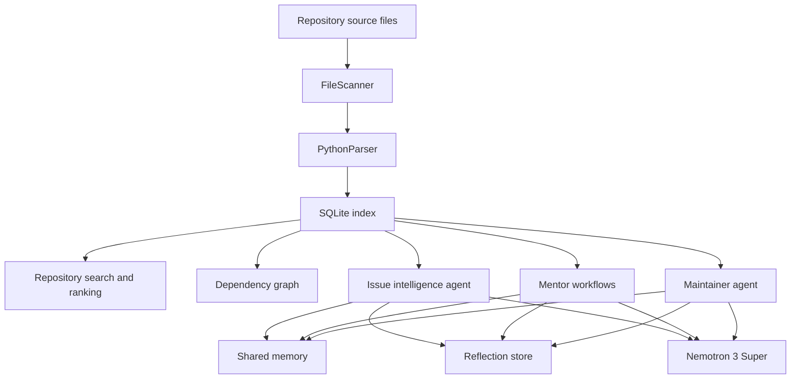

# ForgeMind

### Nemotron-Powered Open Source Maintainer Copilot

ForgeMind is a multi-agent AI system that helps open-source maintainers understand repositories, triage issues, identify architectural risks, and support contributor onboarding using repository intelligence and NVIDIA Nemotron reasoning.

## Problem

Maintaining large open-source projects is difficult.

Maintainers spend significant time:

- understanding unfamiliar code
- triaging issues
- reviewing changes
- identifying risky modules
- helping new contributors onboard

ForgeMind acts as an AI maintainer copilot that combines repository intelligence with Nemotron-powered reasoning.

## Features

### Repository Intelligence

- repository indexing
- AST-based parsing
- dependency graph generation
- impact analysis
- codebase understanding

### Issue Intelligence

- issue triage
- severity estimation
- root-cause analysis
- repository-grounded recommendations

### Contributor Mentor Workflows

- learning paths
- contribution guidance
- difficulty estimation
- recommended files

### Maintainer Advisor

- repository health reports
- architectural hotspot detection
- risk analysis
- maintenance recommendations

### Shared Memory and Reflection

- persistent memory
- reflection storage
- cross-agent knowledge sharing

### Nemotron Integration

- NVIDIA Nemotron reasoning
- structured engineering reports
- repository-aware recommendations

## Architecture

ForgeMind is organized as a CLI on top of a local indexing and agent system.



## System Design

ForgeMind has four main layers:

1. CLI layer - `main.py` wires Typer commands into user-facing workflows.
2. Command layer - `commands/` contains the executable CLI actions.
3. Core intelligence layer - `core/` contains parsing, search, graph, issue, mentor, reporting, and LLM orchestration logic.
4. Persistence and integrations - `storage/` and `integrations/` provide SQLite storage, memory, and GitHub sync helpers.

The data flow is:

```text
Python source files
  -> FileScanner + PythonParser
  -> SQLite `files` table
  -> RepositoryService / RepositorySearch
  -> ranking, graph, triage, maintainer analysis
  -> optional Nemotron reasoning
```

## Agent Architecture

ForgeMind centers on three main agent workflows.

### Repository Intelligence Agent

Builds repository understanding.

It powers:

- context lookup
- file importance scoring
- dependency impact analysis
- enriched explanation output

### Issue Intelligence Agent

Analyzes bugs and issues.

It performs:

- issue classification
- keyword extraction
- context lookup
- plausibility scoring
- severity estimation
- reproduction step generation
- recommendation generation

### Contributor Mentor Workflow

Helps contributors navigate the codebase.

It provides:

- beginner-friendly file ranking
- onboarding analysis
- learning path generation
- difficulty estimation

### Maintainer Advisor Agent

Identifies risks and maintenance priorities.

It provides:

- repository health summaries
- hotspot detection
- maintenance recommendations
- Nemotron-backed report generation

## Nemotron Usage

ForgeMind uses NVIDIA Nemotron through OpenRouter as its reasoning engine.

Nemotron is responsible for:

- issue analysis
- contributor guidance
- maintainer reports
- architectural recommendations

The system combines repository intelligence with LLM reasoning to generate grounded engineering insights.

### Provider

- `core/llm/nemotron_provider.py` wraps the OpenAI client
- the base URL points to `https://openrouter.ai/api/v1`
- the model is `nvidia/nemotron-3-super-120b-a12b:free`
- reasoning can be enabled through the request payload

### Prompt layer

`core/llm/prompt_builder.py` defines prompts for:

- issue analysis
- contributor mentorship
- maintainer reporting

`core/llm/agent_reasoner.py` connects those prompts to the provider.

## Installation

```bash
git clone <repo>
cd ForgeMind
pip install -e .
```

### Environment

```env
OPENROUTER_API_KEY=...
GITHUB_TOKEN=...
FORGEMIND_DB_PATH=...
```

### Optional NLTK data

`core/nlp/keyword_extractor.py` uses NLTK, so download the required corpora:

```bash
python -m nltk.downloader stopwords punkt wordnet omw-1.4
```

## Usage

Index a repository:

```bash
forgemind index .
```

Generate repository summary:

```bash
forgemind summary
```

> Note: `summary` is present in the CLI, but the current implementation depends on a missing `RepositoryService.get_summary()` method.

Analyze an issue:

```bash
forgemind triage
```

Explain a component:

```bash
forgemind explain auth
```

Analyze repository health:

```bash
forgemind maintain
```

Inspect memory:

```bash
forgemind memory
```

Review reflections:

```bash
forgemind reflections
```

Run diagnostics:

```bash
forgemind doctor
```

## Commands

| Command | Description |
|----------|-------------|
| `forgemind` | Dashboard |
| `index` | Index repository |
| `summary` | Repository overview command, currently incomplete in code |
| `graph` | Dependency graph |
| `ask` | Search repository symbols |
| `explain` | Explain repository components |
| `triage` | Analyze issues |
| `maintain` | Maintainer analysis |
| `memory` | Shared memory |
| `reflections` | Reflection history |
| `doctor` | Diagnostics |
| `sync` | GitHub sync helper, present in code but not wired into the CLI |

> Note: mentorship modules exist in code, but a dedicated `mentor` command is not currently registered in `main.py`.

## Example Workflows

### 1. Index repository

```bash
forgemind index .
```

### 2. Explain authentication system

```bash
forgemind explain auth
```

### 3. Triage issue

```bash
forgemind triage "App crashes on startup"
```

### 4. Analyze repository health

```bash
forgemind maintain
```

## Shared Memory and Reflection

ForgeMind stores agent knowledge across runs.

### Memory

- repository analyses
- issue analyses
- contributor guidance

### Reflection

- agent observations
- historical decisions
- continuous knowledge accumulation

## Project Structure

```text
ForgeMind/
|-- main.py
|-- commands/
|-- core/
|-- agents/
|-- storage/
|-- integrations/
|-- forge_mind_cli/
|-- pyproject.toml
`-- README.md
```

## Technical Stack

- Python 3.11+
- Typer
- Pydantic
- Rich
- SQLite
- NLTK
- OpenAI client
- Requests

## Contest Alignment

ForgeMind directly addresses the Open Source Maintainer Copilot challenge.

### Issue Triage

✓ repository-grounded issue analysis

### Codebase Understanding

✓ dependency graph and impact analysis

### Contributor Onboarding

✓ personalized learning paths

### Maintainer Assistance

✓ risk analysis and hotspot detection

### Agentic Workflows

✓ multi-agent architecture

### NVIDIA Nemotron

✓ Nemotron-powered reasoning engine

## Future Work

- GitHub PR review agent
- GitHub issue automation
- semantic search
- embedding-based retrieval
- NeMo Retriever integration
- automated release notes

## License

Add your preferred license here before publishing.
